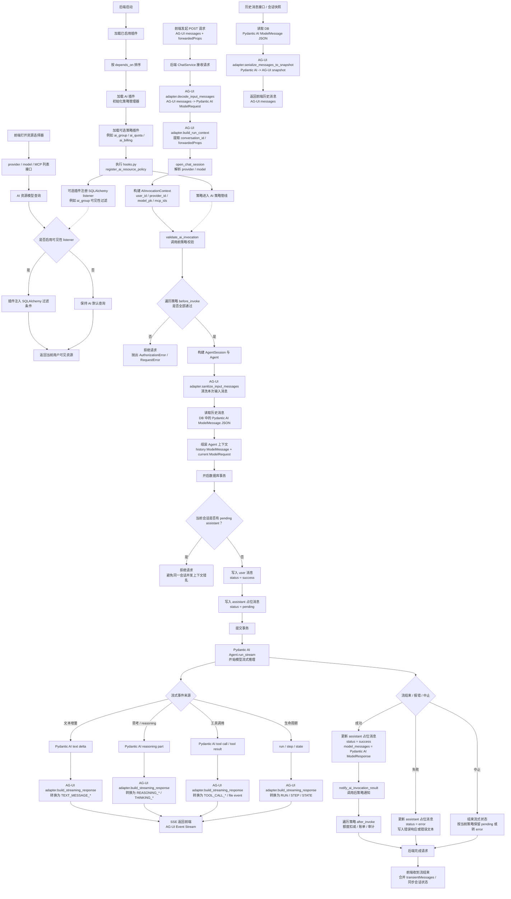

# AI Resource Policy Roadmap

## 当前设计

- `ai` 插件只提供通用策略扩展点，不依赖任何具体策略插件
- 未注册策略时，资源列表默认全部可见，AI 调用默认全部允许
- 可选插件通过 `hooks.py` 注册策略实现，多个策略可以同时生效
- 策略分为调用前校验、调用后通知两个阶段
- provider / model / MCP 列表接口不接入策略管线，资源展示能力由具体插件自行扩展
- 可选插件可通过 SQLAlchemy listener 独立实现资源可见性过滤，不需要改动 AI 策略管线
- provider / model 解析与调用前策略校验内置在 `open_chat_session` 的内部解析流程中，外部调用不直接绕过策略入口
- `AIInvocationContext` 面向通用调用生命周期，包含用户、供应商类型、供应商名称、模型、MCP、生成类型和会话信息
- `AIInvocationResult` 标准化 Pydantic AI 用量字段，保留原始结果用于少数深度扩展场景
- 可选策略插件可按用户分组、额度、租户、套餐等维度实现调用权限与用量处理

## 模块职责

- `policy/context.py` 定义调用前后策略上下文
- `policy/base.py` 定义策略基类与可实现阶段
- `policy/registry.py` 负责策略注册、调用前校验和调用后通知
- 新策略插件直接从 `backend.plugin.ai.policy.*` 导入策略能力

## 策略阶段

### 资源列表展示

- AI 核心不为资源列表暴露策略入口
- AI 核心不聚合、计算或理解可见性规则
- 可选插件可监听 SQLAlchemy `do_orm_execute` 事件，并对自己关心的资源模型追加查询条件
- `ai_group` 使用此方式实现分组资源可见性，调用安全边界仍由调用前校验负责

### 调用前校验

- 用于真正发起 AI 调用前的最终兜底
- 所有真实调用控制都应该放在此阶段
- 多个策略按注册顺序依次执行
- 任一策略拒绝，本次调用拒绝
- 适合 `ai_group`、`ai_quota`、`ai_tenant`、`ai_billing` 等插件实现调用控制

### 调用后通知

- 用于记录用量、扣减额度、写账单或审计日志
- 多个策略按注册顺序依次通知
- 优先使用标准化用量字段，只有确实需要供应商原始信息时再读取 `raw_result`
- 当前调用后策略异常只记录日志，不影响已完成的主调用流程

## 后续策略组建议

- 支持策略声明严格程度，例如调用后失败是否阻断响应或触发补偿
- 支持策略优先级，明确分组、租户、套餐、额度之间的执行顺序
- 支持更完整的调用结果摘要，例如图片数量、供应商响应 ID
- 适用插件包括 `ai_group`、`ai_quota`、`ai_tenant`、`ai_billing`

## 后端对话流程

后端对话接口以 AG-UI 作为外部协议，以 Pydantic AI `ModelMessage` 作为内部消息与存储格式。AG-UI 主要在请求入口、流式事件输出、历史快照输出三个位置介入

